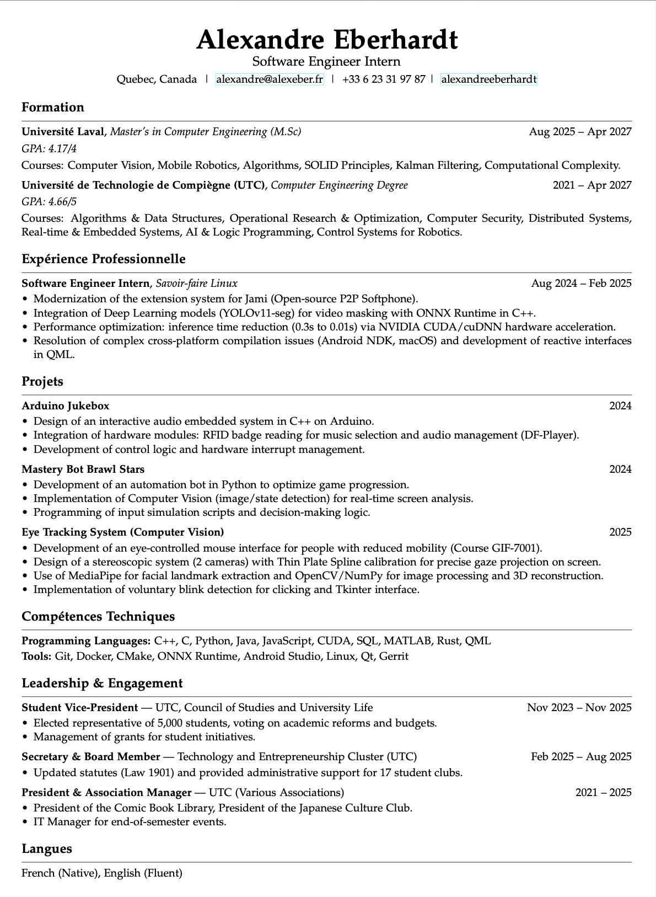
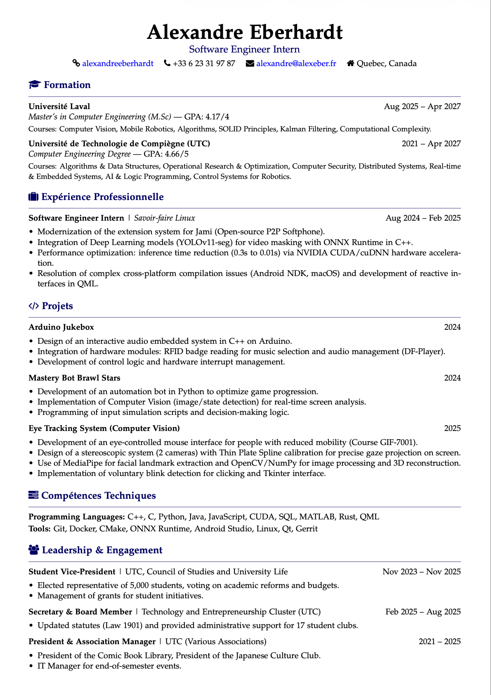

# Sivee.pro

[](https://sivee.pro)
[](https://fastapi.tiangolo.com/)
[](https://react.dev/)
[]()
[](https://creativecommons.org/licenses/by-nc/4.0/)

A web application to generate professional PDF resumes from a dynamic form interface. LaTeX-based PDF generation ensures high-quality typographic output.

**[Live demo: sivee.pro](https://sivee.pro)**

## Examples

Professional resumes generated with different templates:

<p align="center">
  
  
</p>

## Features

### PDF Generation & Templates
- **LaTeX Engine** — High-quality typographic PDF generation (superior to HTML-to-PDF)
- **Professional Templates** — Harvard, Double, Michel, Stephane, Aurianne, McKinsey, Europass and more (each available in Compact, Normal, Large sizes)
- **Smart Auto-Sizing** — Automatically finds the optimal font size to fit content on one page
- **PDF Import** — (Experimental) Import existing CVs via AI extraction (Mistral)

### Editor & Customization
- **Real-time Editing** — Visualize changes instantly as you type
- **Drag and Drop** — Reorganize CV sections freely
- **Dynamic Sections** — Add, rename, hide, or remove any section
- **Dark/Light Mode** — Interface adapted to your preferences
- **Multi-language** — French, English, German, Spanish, Italian, Portuguese

### Accounts & Security
- **Guest Mode** — Try immediately without creating an account (1 resume, 1 download/month)
- **Free Account** — 3 resumes, 3 downloads/month
- **Premium Account** — 100 resumes, 1000 downloads/month
- **Bonus System** — Submit feedback to earn +3 resumes and +5 downloads
- **Seamless Upgrade** — Convert guest account to permanent without data loss
- **Email Verification** — Required before accessing the editor
- **Google OAuth** — Fast sign-in with Google
- **Password Reset** — Secure email-based password reset flow
- **GDPR** — Export all data or delete account in one click
- **Secure Architecture** — Hashed passwords, JWT in HTTP-only cookies, CSRF protection, Redis rate limiting

## Quick Install (Docker)

```bash
# Clone the repository
git clone --recursive git@github.com:alexandreeberhardt/resume-website.git sivee
cd sivee

# Configure environment
cp .env.example .env
# Edit .env with your values (see .env.example for documentation)

# Start development environment
docker compose -f docker-compose.dev.yml up --build
```

The application will be accessible at:
- **Frontend**: http://localhost:5173
- **Backend**: http://localhost:8000
- **API docs (Swagger)**: http://localhost:8000/docs

## Architecture

```
Frontend (React + TypeScript + Vite)
    ↕  REST API (cookies + CSRF)
Backend (FastAPI + SQLAlchemy)
    ↕          ↕          ↕
PostgreSQL   Redis     LaTeX → PDF
                          ↕
                       S3 Storage
```

## Documentation

| Document | Description |
|----------|-------------|
| [Development Guide](docs/DEVELOPMENT.md) | Local setup, project structure, tests |
| [API Reference](docs/API.md) | Endpoints, authentication, examples |
| [Database](docs/DATABASE.md) | Schema, migrations, backups |
| [Deployment](docs/DEPLOYMENT.md) | VPS setup, Nginx, SSL, operations |

## License

This project is licensed under the [Creative Commons Attribution-NonCommercial 4.0 International License](https://creativecommons.org/licenses/by-nc/4.0/).
You may use, share, and adapt this work for **non-commercial purposes only**.
